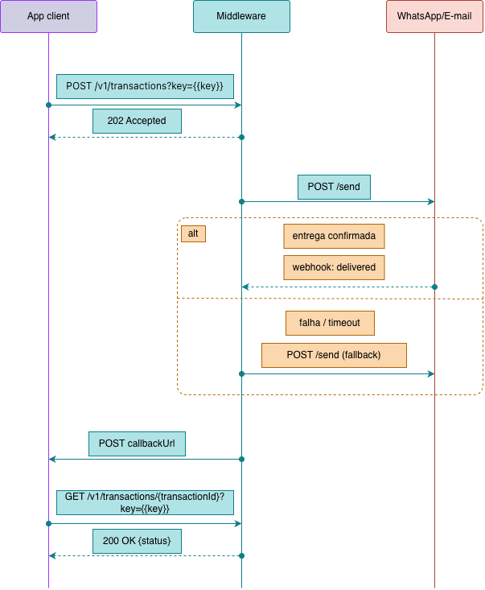

# Middleware: Product Documentation (Final Year Project)

## 1. Overview

### What it is

Middleware is a backend messaging platform: a middleware that centralize the sending of transactional messages to end users, without own interface for the end user. Any client application trigger this platform via API call, instead of implement and maintain its own direct integration with the WhatsApp and e-mail providers.

### Purpose

Solve, one single time and in a reusable way, a problem that repeat in any business system that need to notify its users: how to send a message, by which channel, with which template, and how to know after if it arrived.

### Supported channels

1. WhatsApp, via Meta Cloud API.
2. Transactional e-mail.

### General characteristics

1. Multi-tenant since the conception: each tenant authenticate through a key sent in the own call, for example `{{url}}/transactions?key={{key}}`. Is this key that identify the tenant and guarantee the data isolation in the sending records. Authenticate via query string is a known technical debt, see section 10.
2. The catalog of message types is closed, limited to a small set of messages pre-registered by Middleware (five, see section 8). The tenant don't register own messages, only choose between the existing ones through the field `messageId`.
3. The tenant can consult the catalog of available messages, and the `messageId` of each one, through an own consultation API.
4. Each sending call carry two identification fields: `channelId`, that indicate the channel of the message (1 for WhatsApp, 2 for e-mail, 3 for both), and `messageId`, that indicate which of the catalog messages must be used. The two fields are independents: the same `messageId` can be sent by any `channelId`.
5. The body of each call also carry the customized datas of the message: the recipient and the variables that the template of that `messageId` will use, like order number and link.
6. When `channelId` is 1 or 2 (only one channel), the tenant can optionally mark `fallback: true`, asking to Middleware to try the alternative channel in case of failure in the main channel, since the data of the alternative channel was also sent. When `channelId` is 3, the field `fallback` is ignored, because the two channels are already tried anyway.
7. For batch sendings, the body carry a list of recipients (`recipients`), each one with their own contact datas and variables, under the same `channelId` and `messageId` of the entire batch.
8. For the WhatsApp channel, all the tenants send using one single corporate number/line of Middleware, not an own line per tenant. One single WhatsApp Business Account, with templates approved one time, serve for everybody.
9. For the e-mail channel the same logic is valid: all the tenants send from one single sender of Middleware, configured in the service itself, without the tenant inform sender in the call. In this project is used a test sender. In a commercial product would be necessary an own corporate domain, verified with the e-mail provider.
10. Service deliberately "dumb" about the recipient and the moment of the sending: who trigger Middleware always resolve to whom send and decide when send. Middleware only know which template to use and how to fill it.

---

## 2. Architecture diagram




---

## 3. Key concepts

Before describe the flows, three concepts need to be clear, because they are referenced all the time in the rest of the document.

1. Tenant: the client application that is integrated to Middleware, identified by the key sent in each call.
2. Transaction: an individual message, sent alone (isolated sending) or as part of a batch (batch sending). Every transaction have its own `transactionId`, generated by Middleware in the moment of the processing, never informed by the tenant.
3. Batch: a grouping of transactions sent together, at once. Every batch have its own `batchId`, also generated by Middleware.

The relation between the two: every transaction have a `transactionId`. When the transaction came from a batch, it also carry the `batchId` which it belongs. When the transaction came from an isolated sending, the field `batchId` stay null. This permit to answer, for any transaction, if it came from an isolated call or from a batch, and which batch.

As the tenant don't know the `transactionId` in the moment of the sending, since it only exist after Middleware process the call, the response of the batch sending return, for each recipient sent, the generated `transactionId` and its `index` in the original list, used for the tenant to relate the response with the recipient that he sent.

Illustrative example, response of a batch with two recipients:

```json
{
  "batchId": "b1e2c3d4-8f3a-4a2e-9c1d-7e6f5a4b3c2d",
  "transactions": [
    { "transactionId": "a1b2c3d4-...", "index": 0, "status": "queued" },
    { "transactionId": "f47ac10b-58cc-4372-a567-0e02b2c3d479", "index": 1, "status": "queued" }
  ]
}
```

With this, the status consultation by `transactionId` always bring, together with the transaction datas, the corresponding `batchId` when it belongs to a batch, or `null` when is an isolated sending.

---

## 4. Architecture principles

1. Tenant resolved by the key sent in each call, never fixed in the code.
2. Every sending attempt is recorded in database (not in memory), with the ID of the provider (when have), the `transactionId`, the `batchId` (when have), the ID of the tenant and the status of the sending. Record also the failures is essential, for example to identify a user that never received a notification because of a phone number registered wrong.
3. Abstraction of message type: each `messageId` of the catalog map to an approved template, allowing to change the template content in the future without impact who consume the service. The channel (`channelId`) is independent of the template, chosen by the tenant in each call.
4. General principles of software architecture are valid equally here: parameterized SQL, dependency injection, separation of responsibilities.

---

## 5. Technology stack

1. .NET 10, C#.
2. MySQL as database.
3. Layered architecture (N-tier).
4. xUnit for unit tests.
5. Docker for containerization.
6. Hosting on Railway.
7. Meta Cloud API for sending by WhatsApp.
8. Resend for sending by e-mail.

---

## 6. Single message sending (synchronous API)

### What it is

Sending channel for individual and immediate messages, where who trigger need a confirmation that the sending was accepted for processing.

### How it works

1. Client application (ex: a fleet management or scheduling system) call the Middleware API informing the `messageId` of the catalogued message, the `channelId`, optionally `fallback`, the `callbackUrl`, the recipient and the variables to fill.
2. Middleware validate the call and map the `messageId` to the corresponding approved template.
3. Middleware generate a `transactionId` and record the transaction in the database with status `queued` (tenant, recipient, `messageId`, `channelId`, `transactionId`, `batchId` null, `callbackUrl`, date/time).
4. Middleware return `202 Accepted` with the `transactionId` and the status `queued` for who called.
5. Middleware execute the sending via provider (Meta Cloud API for WhatsApp, transactional e-mail provider for e-mail), according the `channelId` informed, and record in the transaction the ID returned by the provider.
6. When the status of the transaction change (ex: sent, delivered, failed), Middleware notify the client application through a callback call to the `callbackUrl` informed in that transaction.

### Important business rules

1. Used for messages that need to be delivered immediately and where one single person is notified per time, like the first access invite and the password reset.
2. Middleware don't decide if must send or not, only execute and confirm. The decision of trigger was already taken by who called.
3. The `callbackUrl` is informed in each call, is not a data registered before by the tenant. If it come absent, Middleware just don't notify, the tenant stay depending of the manual status consultation.

### Technical contract

**Sending the message:**

```json
POST /v1/transactions?key={{key}}

{
  "channelId": 3,
  "messageId": 5,
  "fallback": true,
  "callbackUrl": "https://tenant.example.com/webhooks/middleware",
  "recipient": {
    "name": "Maria Silva",
    "phone": "+353123456789",
    "email": "maria@example.com",
    "variables": {
      "registrationNumber": "12345",
      "institutionName": "Instituto Exemplo",
      "link": "https://example.com/visa-renewal/12345"
    }
  }
}
```

```json
202 Accepted

{
  "transactionId": "f47ac10b-58cc-4372-a567-0e02b2c3d479",
  "status": "queued"
}
```

**Callback (notification of status change):**

```json
POST {callbackUrl}

{
  "transactionId": "f47ac10b-58cc-4372-a567-0e02b2c3d479",
  "batchId": null,
  "status": "delivered",
  "updatedAt": "2026-09-23T14:02:04Z"
}
```

**Status consultation:**

```json
GET /v1/transactions/f47ac10b-58cc-4372-a567-0e02b2c3d479?key={{key}}

200 OK

{
  "transactionId": "f47ac10b-58cc-4372-a567-0e02b2c3d479",
  "batchId": null,
  "messageId": 5,
  "channelId": 3,
  "recipient": {
    "name": "Maria Silva",
    "phone": "+353123456789",
    "email": "maria@example.com"
  },
  "status": "delivered",
  "createdAt": "2026-09-23T14:02:00Z",
  "updatedAt": "2026-09-23T14:02:04Z"
}
```

### Integration pattern

Synchronous API call, consumed by client applications in flows like authentication and access recovery.

### Open points

1. How to protect the application against denial of service attacks (DDoS), or against bad implementation of partner, where, instead of wait the callback, the tenant keep consulting the status of the transaction repeatedly in short interval of time.

---

## 7. Bulk message sending (batch)

### What it is

Sending channel for reminders or notifications fired to many recipients at once, without necessity of immediate response of each individual transaction.

### How it works

1. Client application publish a batch informing the `messageId`, the `channelId`, optionally `fallback` and `callbackUrl`, valid for the entire batch, and the list `recipients` with the datas and the variables of each recipient.
2. Middleware generate a `batchId` for the entire set, and a `transactionId` for each recipient inside it.
3. The client application act as producer of the queue, Middleware as consumer.
4. Middleware process the queue in asynchronous way, respecting the rate limits of the provider.
5. Each processed transaction is recorded in the database with its `transactionId` and the `batchId` which it belongs, in the same way of the isolated sending, but with the link to the batch filled.
6. When the status of each transaction of the batch change, Middleware notify the client application through a callback call to the informed `callbackUrl`, one call per transaction.

### Important business rules

Used for cases like periodic reminders, where the client application scan daily a business condition (ex: pendencies, expired deadlines) and fire a notification for each affected user at once.

Example: the client application control who have visa valid, expired or about to expire. The client application generate a list of users with expired visa and send a batch of notifications informing that the person need to regularize the situation, and until there the registration will stay suspended.

The `callbackUrl` is informed in each batch call, is not a data registered before by the tenant. If it come absent, Middleware just don't notify, the tenant stay depending of the manual status consultation.

### Technical contract

**Sending the batch:**

```json
POST /v1/batches?key={{key}}

{
  "channelId": 1,
  "messageId": 5,
  "fallback": true,
  "callbackUrl": "https://tenant.example.com/webhooks/middleware",
  "recipients": [
    {
      "name": "Maria Silva",
      "phone": "+353123456789",
      "email": "maria@example.com",
      "variables": {
        "registrationNumber": "12345",
        "institutionName": "Instituto Exemplo",
        "link": "https://example.com/visa-renewal/12345"
      }
    },
    {
      "name": "Eva Silva",
      "phone": "+353123456780",
      "email": "eva@example.com",
      "variables": {
        "registrationNumber": "54321",
        "institutionName": "Instituto Exemplo",
        "link": "https://example.com/visa-renewal/54321"
      }
    }
  ]
}
```

```json
202 Accepted

{
  "batchId": "b1e2c3d4-8f3a-4a2e-9c1d-7e6f5a4b3c2d",
  "transactions": [
    { "transactionId": "a1b2c3d4-...", "index": 0, "status": "queued" },
    { "transactionId": "f47ac10b-58cc-4372-a567-0e02b2c3d479", "index": 1, "status": "queued" }
  ]
}
```

**Callback (notification of status change, one per transaction):**

```json
POST {callbackUrl}

{
  "transactionId": "f47ac10b-58cc-4372-a567-0e02b2c3d479",
  "batchId": "b1e2c3d4-8f3a-4a2e-9c1d-7e6f5a4b3c2d",
  "status": "delivered",
  "updatedAt": "2026-09-23T14:02:04Z"
}
```

**Status consultation of one transaction of the batch:** follow the same contract already described in section 6, `GET /v1/transactions/{transactionId}?key={{key}}`, with the `batchId` filled instead of null.

### Integration pattern

Message queue (asynchronous messaging), with the client application as producer and Middleware as consumer.

### Open points

1. Choice of the queue technology/broker still not defined. It stay for when the technical implementation is started, is not a product decision.
2. If will exist an aggregated consultation by `batchId` (general status of the entire batch: how many transactions sent, failed, pending), or if the tenant always consult transaction by transaction. We didn't decided yet.
3. The same concerns of protection against DDoS and repeated consultation in sequence, registered in the previous section, are valid here too, possibly in a even more critical way, since one single batch can generate hundreds of transactions at once.

---

## 8. Message types (contract)

### What it is

Each message type supported by Middleware have its own `messageId` in the catalog, mapping to an approved content template. The sending channel (`channelId`) is chosen by the tenant in each call, independent of the `messageId`: the same template can be sent by WhatsApp, e-mail, or both, since the content don't depend of particularities of a specific channel.

### Catalog of messages (closed, five types)

| messageId | Name | Description | Required variables |
|---|---|---|---|
| 1 | First Access Invite | Sent when a new user is registered by the client application, containing the link for definition of password. | `name`, `link` |
| 2 | Password Reset | Sent when a user request to reset the password, containing the link with token. | `name`, `link` |
| 3 | Pending Reminder | Sent to the users that still didn't completed an expected action inside the deadline. | `name`, `link` |
| 4 | Order Shipped | Sent when an order of the user go out for delivery. | `name`, `orderNumber`, `link` |
| 5 | Visa Expiration Notice | Sent to users with residence visa close of the expiration. | `name`, `registrationNumber`, `institutionName`, `link` |

All the five fit in the Utility category of WhatsApp Business, category of approval more simple because don't have promotional character, keeping the same direct and informative tone of the template already in production in the account.

### Approved templates (illustrative messages)

**messageId 1, First Access Invite:**
```
Hi {{name}}, your access to the system has been created. To set your
password and get started, please use the link below: {{link}}
```

**messageId 2, Password Reset:**
```
Hi {{name}}, we received a request to reset your password. To
continue, use the link below: {{link}}. If you didn't request this,
you can safely ignore this message.
```

**messageId 3, Pending Reminder:**
```
Hi {{name}}, we haven't received your update yet for today. Please
take a moment to complete your pending record so everything stays
up to date. You can access the system here: {{link}}
```

**messageId 4, Order Shipped:**
```
Hi {{name}}, your order {{orderNumber}} has been shipped. For more
details, you can track it here: {{link}}
```

**messageId 5, Visa Expiration Notice:**
```
Hi {{name}}, we noticed that your residence visa is about to expire.
Your registration number {{registrationNumber}} is linked to this
document. If you have already started your renewal process, please
access the link below and complete the requested steps: {{link}}.
Regards, {{institutionName}}
```

### Technical contract

**Consultation of the catalog of messages:**

```json
GET /v1/message-types?key={{key}}

200 OK

[
  { "messageId": 1, "name": "First Access Invite" },
  { "messageId": 2, "name": "Password Reset" },
  { "messageId": 3, "name": "Pending Reminder" },
  { "messageId": 4, "name": "Order Shipped" },
  { "messageId": 5, "name": "Visa Expiration Notice" }
]
```

### Important business rules

1. The catalog is closed, limited to these five messages. New types would require change of scope of Middleware, is not something that the tenant register by his own.
2. In all the message types, is always who trigger Middleware that resolve the recipient (phone number or e-mail address) before the call. Middleware never decide or discover by its own to whom send.
3. The field `name` of the recipient fill automatically the variable `{{name}}` of the template, without need to be repeated inside `variables`. The others variables required by the template (see table of the catalog) come from the object `variables` sent in the call.
4. In all the message types, the link come entirely as variable provided by the tenant in the call. Middleware only insert the value in the template, without generate or validate the content of the link. In the case of the first access invite and the password reset, the generation and validation of the single use token is also responsibility of the tenant..

### Open points

The WhatsApp Business API require that the text of the template is pre-approved by Meta, with few flexibility of formatting. The e-mail don't have this restriction. As the same `messageId` can be sent by any of the two channels, it stay open if each message will have one template version per channel (one for WhatsApp, other for e-mail), or if the text will be unique and restricted to the most limited format of the two, even when sent by e-mail.

---

## 9. List of exposed APIs

Consolidation of all the endpoints defined in the previous sections. All the calls require the parameter `key` in the query string (`?key={{key}}`), as described in section 1.

| Method | Endpoint | Description | Detailed in section |
|---|---|---|---|
| POST | `/v1/transactions` | Single sending of one message | 6 |
| GET | `/v1/transactions/{transactionId}` | Status consultation of a transaction (isolated or of batch) | 6 |
| POST | `/v1/batches` | Sending of a batch of messages | 7 |
| GET | `/v1/message-types` | Consultation of the catalog of available messages | 8 |

Besides that, Middleware is who make an outgoing call, not exposed as own API: the callback (`POST {callbackUrl}`), fired to the URL informed by the tenant in each transaction, always that its status change.

---

## 10. Technical pendencies

1. Choice of the queue technology/broker for bulk sendings (see also section 7).
2. Protection against DDoS and against abusive status consultation in sequence (see also sections 6 and 7).
3. Authentication via query string (`?key={{key}}`) is the best way? how companies do this process?
5. Time limit of transactions without return of the provider: define after how much time a pending transaction is marked as failed. This time also define when the fallback is triggered.
6. Security of the received webhooks: validate the signature sent by Meta and by Resend, for only them can update the status of a transaction.
7. Security of the sent callbacks: sign the callbacks of Middleware, for the tenant can confirm that the notice came really from Middleware. 
8. Possible status of a transaction: define the official list and the meaning of each one, for example `queued`, `sent`, `delivered` and `failed`, making clear that `delivered` mean delivered to the destination, without guarantee of inbox or reading. 
9. Modeling of the database, define the tables, fields and relationships (tenants, transactions, batches, catalog of messages), from the datas already described in sections 3, 4 and 6.

---
